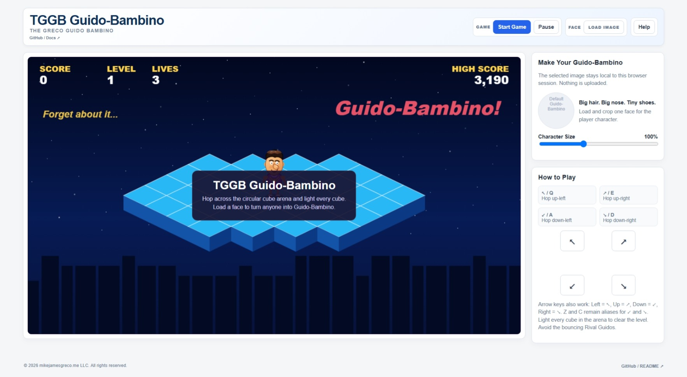

# TGGB - G-Bert

**The Greco G-Bert**

A lightweight, local-first browser arcade game where G-Bert hops across
an isometric cube pyramid, changes cube colors, dodges roaming Globs,
and can even wear your face.

TGGB is built as a **Single-File Local Application (SFLA)**. The game
runs directly in a modern browser with no application server, package
manager, framework, installation process, or third-party runtime
dependencies.

Load your own local image, crop the face you want to use, and become
G-Bert while you clear the pyramid one cube at a time.

> **Same cubes. Different dude.**



## Play TGGB

**[▶ Play TGGB - G-Bert in your browser](https://mikejamesgreco.github.io/tggb-g-bert/)**

No installation is required. The GitHub Pages version runs TGGB directly
in your browser, just like opening the standalone `tggb-g-bert.html`
file locally.

------------------------------------------------------------------------

## Features

-   Isometric cube-hopping arcade gameplay
-   Diagonal movement across a pyramid of cubes
-   Change every cube top to complete a level
-   Original colorful roaming enemies called Globs
-   Increasing levels and difficulty
-   Score, lives, level, and local high score tracking
-   Keyboard and touch controls
-   Optional local face image for the G-Bert character
-   Interactive crop and zoom tool for positioning your face
-   Cartoon default G-Bert character with retro greaser styling
-   Retro arcade presentation with stars, skyline, and colorful cube graphics
-   Single-file HTML application
-   No frameworks or third-party runtime dependencies

------------------------------------------------------------------------

## Getting Started

You can either use the **[hosted TGGB game](https://mikejamesgreco.github.io/tggb-g-bert/)**
or download/clone the repository and open:

``` text
tggb-g-bert.html
```

in a modern web browser.

Use the movement controls to hop diagonally from cube to cube. Landing
on a cube changes its top color. Change every cube to complete the
level while avoiding Globs and staying on the pyramid.

Choose **Load Face** if you want to replace the default G-Bert face with
an image from your computer. Use the crop and zoom controls to position
the face before playing.

No installation, web server, or build process is required.

------------------------------------------------------------------------

## Controls

TGGB supports both keyboard and touch controls.

``` text
Q / Left Arrow    Up-left
E / Up Arrow      Up-right
Z / Down Arrow    Down-left
C / Right Arrow   Down-right
```

Touch controls are also available directly in the game interface.

------------------------------------------------------------------------

## Local-First

TGGB is designed to keep the game simple and your images local.

Images selected in TGGB are processed in your browser and are not
uploaded to a TGGB server. They are used for the game session and remain
under your control.

TGGB follows the same **Single-File Local Application (SFLA)**
philosophy as the other Greco browser applications: use browser-native
capabilities where practical and avoid unnecessary runtime
infrastructure.

------------------------------------------------------------------------

## Repository Structure

The repository can remain very simple:

``` text
tggb-g-bert/
│
├── index.html              # GitHub Pages launcher
├── tggb-g-bert.html        # Standalone TGGB game
├── screenshot.jpeg         # Project screenshot
├── README.md
└── LICENSE
```

------------------------------------------------------------------------

## Browser Support

TGGB is designed for modern desktop browsers and also supports touch
controls on compatible devices. Exact browser behavior can vary slightly
for audio and local file handling.

------------------------------------------------------------------------

## Privacy

Your selected face image remains local to your browser and is used only
by the game. TGGB does not require an account, backend service, or image
upload.

------------------------------------------------------------------------

## License

See the repository `LICENSE` file for details.

------------------------------------------------------------------------

## Author

**Michael J. Greco**

TGGB - G-Bert --- **The Greco G-Bert**

© mikejamesgreco.me LLC. All rights reserved.
